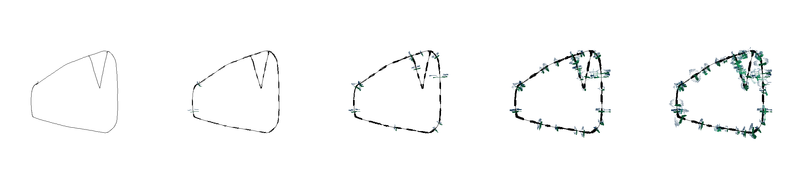
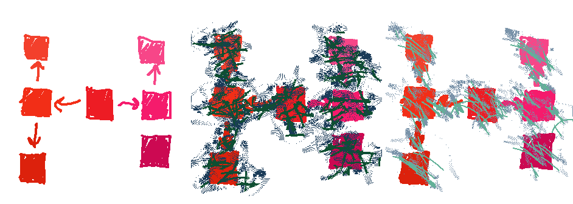

# Itten: Graph Spectral Attention Shader

**Status: Active Development — nn.Module pipeline complete, subsystem recovery in progress**

This repository demonstrates what "copy heads" and "read heads" in a graph spectral attention model *could* implement using extremely shallow layer counts without relying on complex parameter-only learned priors.

## What This Is

The pipeline uses a complete nn.Module architecture (`SpectralShader`) with Triton-accelerated
batched Lanczos, optional bfloat16 mixed precision, and segment-based cross-attention. It demonstrates:

1. **Spectral segment matching** - using Fiedler vectors (2nd eigenvector of the graph Laplacian) to identify and match structurally similar regions across images
2. **Copy/rotate operations** - physically repositioning pixel segments based on spectral signatures
3. **Autoregressive refinement** - ADSR-envelope controlled iterative shading

The codebase shows that meaningful visual transformations can emerge from spectral graph operations alone, without learned parameters.

## Self-Attention vs Cross-Attention

### Self-Attention (Single Image Autoregressive)

When an image "attends to itself," the shader:
- Identifies spectral segments (connected regions with similar graph Laplacian structure)
- Copies and rotates segments into nearby voids
- Thickens contours based on local spectral complexity
- Iteratively refines over multiple ADSR-envelope controlled passes



The progression shows feature accretion from the same source: existing structure propagates and densifies without external input. Color distortion is minimal because source and target share the same palette.

### Cross-Attention (Two Image Transfer)

When image A (target) attends to image B (source):
- A provides **topology queries**: WHERE to place segments, WHAT spectral structure to seek
- B provides **content**: WHAT pixels/colors to actually copy
- Spectral signatures match segments across images despite different sizes


The color distortion filter reveals which visual properties come from which source:
- Structure/position: from target (A)
- Texture/color: from source (B)

### Source Texture Comparison

The same target topology with different source textures:



## Z-Buffer Mode (Sum Contributions)

By default, when multiple segments write to the same pixel, last-write-wins (replacement semantics). With `--no-overwrite` flag, overlapping contributions are summed and averaged:

```bash
uv run python demo_spectral_shader.py --no-overwrite
```

In z-buffer mode:
- Overlapping segment pixels are **summed** then normalized by count
- Multiple segments writing to the same location produce blended colors
- Prevents any single segment from dominating shared regions

This demonstrates the difference between:
- **Replacement**: later segments overwrite earlier (standard mode, last-write-wins)
- **Blending**: overlapping segments blend colors (z-buffer mode, sum/average)

**Note:** The effect is only visible when segments actually overlap. With few/small segments, both modes may produce identical output.

## Running the Demos

```bash
# Install dependencies
uv sync

# Run all demos (self + cross attention, standard mode)
uv run python demo_spectral_shader.py

# Self-attention only
uv run python demo_spectral_shader.py --self

# Cross-attention only
uv run python demo_spectral_shader.py --cross

# Z-buffer mode (no overwrite)
uv run python demo_spectral_shader.py --no-overwrite

# Customize passes
uv run python demo_spectral_shader.py --passes 8
```

## Configuration (ADSR Envelope)

The shader uses an Attack-Decay-Sustain-Release envelope to control growth rate across passes:

| Phase   | `thicken_modulation` | `kernel_sigma_ratio` | `fill_threshold` | `dilation_radius` |
|---------|---------------------|---------------------|------------------|-------------------|
| Attack  | 0.2 (aggressive)    | 0.8 (spread)        | 0.05 (more fill) | 3                 |
| Decay   | 0.3                 | 0.6                 | 0.1              | 2                 |
| Sustain | 0.5                 | 0.5                 | 0.15             | 2                 |
| Release | 0.7 (minimal)       | 0.4 (tight)         | 0.2 (less fill)  | 1                 |

These parameters can be adjusted in `demo_spectral_shader.py` or passed via config dict.

## Key Files

### Active Pipeline (nn.Module path)

| File | Role |
|------|------|
| `spectral_shader_model.py` | `SpectralShader` nn.Module — primary entry point (`from_config()`) |
| `spectral_shader_layers.py` | nn.Module building blocks (gate, thicken, shadow, cross-attention) |
| `spectral_embedding_layer.py` | `SpectralEmbedding` — tiled Lanczos Fiedler computation as nn.Module |
| `spectral_shader_ops_cuter.py` | Functional implementation the Modules delegate to |
| `spectral_triton_kernels.py` | Triton ELL-format SpMV kernel (single + batched) with PyTorch fallback |
| `demo_spectral_shader.py` | Demo script with ADSR envelope |
| `spectral_shader_main.py` | Composable CLI (single/paired images, AR passes, quality presets) |
| `benchmark_pipeline.py` | 20-pair cross-attention benchmark for regression detection |
| `image_io.py` | Timestamped image I/O (prevents accidental overwrites) |

### Subsystem Recovery (Phases A–E, in progress)

| File | Role | Status |
|------|------|--------|
| `spectral_graph_embedding.py` | GraphEmbedding, LocalSpectralProbe, ImageLaplacianBuilder | Phase A |
| `spectral_renderer.py` | HeightToNormals, BilinearSampler, EggSurfaceRenderer | Phase B |
| `spectral_lattice.py` | LatticeTypeSelector, ExpansionGatedExtruder | Phase C |
| `spectral_pathfinder.py` | SpectralPathfinder (local spectral navigation) | Phase D |
| `demos/` | Composition scripts (bump render, lattice texture, pathfinding) | Phase E |

### Legacy (retained for regression testing / subsystem deps)

| File | Role | Why kept |
|------|------|----------|
| `spectral_shader_ops.py` | Original verbose shader implementation | Regression tests import it |
| `spectral_ops_fast.py` | Original numerical kernel | 41 subsystem files import it |
| `spectral_ops_fast_cuter.py` | Minimal spectral ops reimplementation | Research modules use it |

### Archived → `sketches/`

Deprecated files with zero active imports have been moved to `sketches/`:
`spectral_ops_fns.py`, `spectral_correspondence_unified.py`, `spectral_coarsened.py`, `spectral_local_structure.py`

Both `spectral_shader_main.py` and `demo_spectral_shader.py` use `SpectralShader.from_config()`.

## Performance: Reference vs Module Path

Benchmark on 20 cross-attention pairs (mixed resolutions up to 1152x832, CUDA, RTX-class GPU).
Run via `benchmark_pipeline.py`:

```bash
uv run python benchmark_pipeline.py                  # 20 pairs, float32
uv run python benchmark_pipeline.py --dtype bfloat16  # 20 pairs, bfloat16
uv run python benchmark_pipeline.py --pairs 5         # Quick smoke test
```

### Historical comparison

| Path | Total (20 pairs) | Per pair |
|---|---|---|
| **Reference** (`spectral_shader_ops.shader_forwards`) | 142.2s | 7108 ms |
| **Module** (`SpectralShader.from_config()`, float32) | 24.9s | 1243 ms |
| **Module** (`SpectralShader.from_config()`, bfloat16) | 21.1s | 1053 ms |

The nn.Module path is **~6x faster** than calling `spectral_shader_ops.py` functions
directly. Both produce equivalent output (verified by e2e regression tests).

### Mixed-Precision bfloat16

The pipeline supports optional bfloat16 computation via `compute_dtype` config:

```python
model = SpectralShader.from_config({"compute_dtype": torch.bfloat16})
# or: SpectralShader.from_config({"compute_dtype": "bfloat16"})
```

**Two-zone precision architecture:**
- **Zone A (always float32):** Lanczos iteration, eigenvalue solve, eigenvector projection.
  Numerical sensitivity makes reduced precision fatal here.
- **Zone B (compute_dtype):** Image tensors, Fiedler vectors (post-computation), gate/contour
  masks, shader ops, cross-attention matching, scatter/composite.

**Quality at bfloat16:** mean absolute diff 0.003 (~0.7/255), cosine similarity 0.999,
Fiedler correlation 0.99999. Bit-exact when compute_dtype=float32.

**Performance:** ~15% faster aggregate, with 50% reduction in ELL buffer memory.
The speedup is modest because Lanczos (Zone A, always float32) dominates at ~60% of runtime.

### Fused kernels + Triton acceleration

The Module path benefits from several levels of optimization in `SpectralEmbedding`:

**Level 1: Fused operations** (vs reference, 16% gain)

| Fusion | What it does |
|--------|-------------|
| Fused Lanczos recurrence | 3-term recurrence absorbed into reorthogonalization |
| Pre-computed Laplacian offsets | Multi-radius neighbor offsets as registered buffers |
| Pointer-jumping connected components | O(log diameter) vs O(diameter), vectorized |
| Batched blend / inline complexity / vectorized transplant | Misc kernel savings |

**Level 2: Structural acceleration** (vs reference, ~6x gain)

| Optimization | What it does |
|--------|-------------|
| **Pre-computed ELL sparsity** | Graph structure computed once in `__init__`; only color-dependent weights recomputed per tile |
| **Batched multi-tile Lanczos** | 8 tiles processed simultaneously through batched SpMV + reorthogonalization |
| **Triton ELL SpMV kernel** | Custom Triton kernel for ELLPACK-format sparse matvec; avoids materializing (B, n, max_nnz) intermediates |
| **CSR format** | Laplacian stored as CSR for optimized row-wise access |

### Where the time goes (Module path)

```
Batched Lanczos (Triton SpMV)   ~60%   ← 121 tiles in 15 batches of 8
Laplacian construction          ~25%   ← batched color diff + exp
Shader ops                      ~10%   ← segment extract, match, rotate, composite
Overhead                         ~5%
```

### Implications

- **Module path is the correct default.** ~6x speedup, nn.Module composability,
  and a clean `forward()` API.
- **~1s/pair at 512x512** approaches interactive rates for lower resolutions.
- The reference path (`spectral_shader_ops.py`) is retained for regression testing only.

## Technical Details

### Spectral Operations

1. **Graph Laplacian**: Built from image with multi-radius connectivity (handles dithered images)
2. **Fiedler Vector**: 2nd eigenvector via tiled Lanczos iteration
3. **Spectral Gate**: Sigmoid on Fiedler separates high/low spectral regions
4. **Complexity Field**: Standardize + sigmoid normalized gradient magnitude

### Copy Head Mechanics

1. **Segment Extraction**: Connected components in low-gate regions
2. **Spectral Signature**: `[mean_fiedler, std_fiedler, log(size), aspect_ratio]`
3. **Cross-Image Matching**: L2 distance in signature space
4. **Shadow Projection**: Diameter-based, complexity-modulated outward offset

## Subsystem Recovery (In Progress)

Beyond the core shader pipeline, the project includes subsystem modules being recovered
as nn.Modules (see `TODO_DEMO_RECOVERY.md`):

- **GraphEmbedding** — accepts arbitrary Laplacians (not just images), with LocalSpectralProbe
  for graph-local Fiedler computation
- **Rendering** — height-to-normals, bilinear sampling, egg surface rendering (pure torch)
- **Lattice** — spectral lattice type selection (hex/tri/square) + expansion-gated extrusion
- **Pathfinding** — local spectral navigation (Dijkstra approximation without O(n^2))

These subsystems still depend on `spectral_ops_fast.py` (legacy kernel) and will be
migrated to the nn.Module pipeline as Phases A–E complete.

## What This Demonstrates

The operations shown here map directly to DNN primitives:

| Shader op | DNN analog |
|-----------|-----------|
| `dilate_high_gate_fused` | Spatial Transformer (Jaderberg 2015) |
| `cross_attention_transfer` | Discretized attention / VQ-VAE lookup (van den Oord 2017) |
| Lanczos iteration | Implicit/DEQ layer (Bai 2019) |
| `fiedler_gate` + path routing | GLU/SwiGLU gating (Shazeer 2020) |

These could be implemented as attention heads in a transformer-like architecture, where
spectral signatures serve as queries/keys and pixel content serves as values.

## License

MIT
